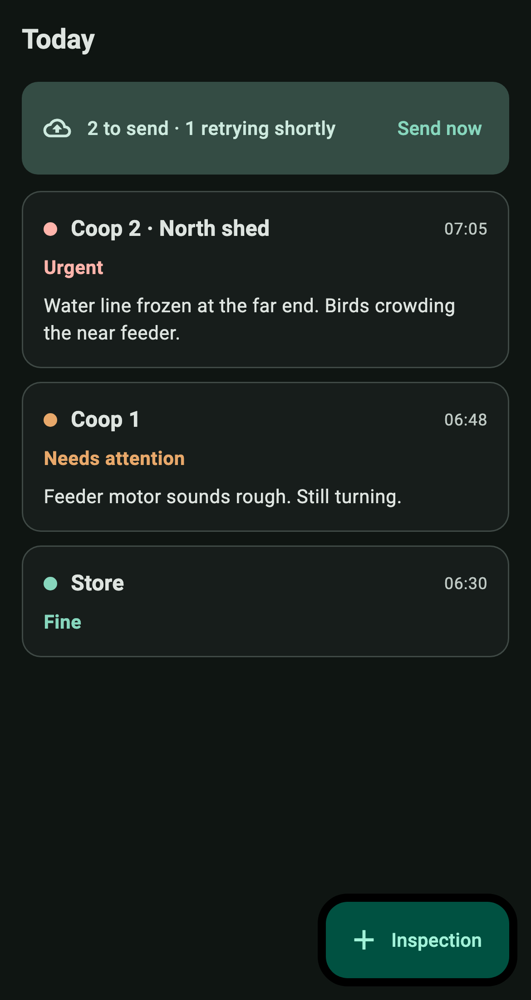
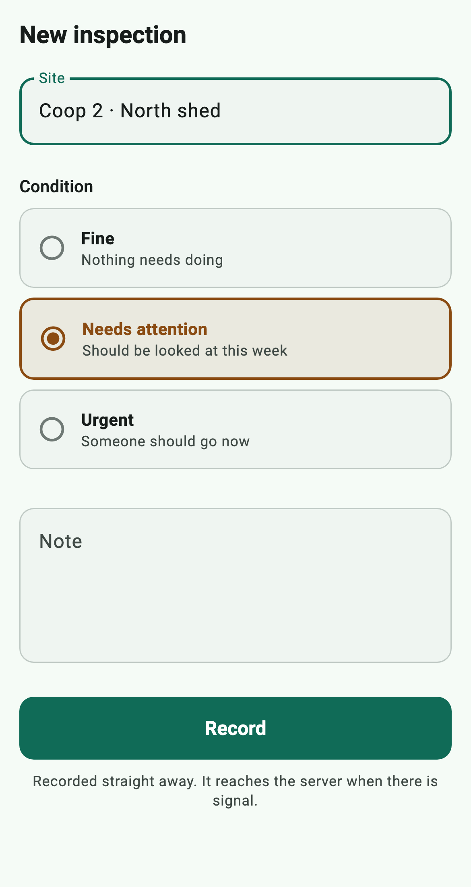

# FieldLog

[](https://github.com/Mustafa0u0/fieldlog/actions/workflows/ci.yaml)

Offline-first inspections. Record them anywhere; they reach the server when the
signal does.

Built on [outbox_queue](https://github.com/Mustafa0u0/outbox_queue) — a durable
queue for exactly this problem.

<p>
  
  
</p>

## The idea

An inspector standing in a field has already done the work. Software that
refuses to accept it because of one bar of signal is software that gets worked
around with a paper pad — and then the round never reaches the office at all.

So nothing here waits on the network. An inspection is written to the outbox
and the screen updates immediately. Delivery is the queue's problem, on its own
schedule.

## What that costs, and how it is paid

**Ordering matters per site, not globally.** Two inspections of the same coop
must arrive in the order they were made — the second describes what changed
since the first. Two inspections of *different* coops have nothing to say to
each other. So each site is its own lane: a site the server keeps rejecting
does not hold up the rest of the round.

**Some failures are permanent.** An inspection with no site will never be
accepted, however many times it is retried, and retrying it would block that
lane until the attempts ran out. It is parked instead, and surfaced as "needs
attention" rather than silently dropped.

**Connectivity is not watched.** The platform will happily report a connection
to a router with no route beyond it, so the only honest test of whether the
server is reachable is trying to reach it. A quiet twenty-second loop tries;
the queue's own backoff stops that becoming a hammer.

## Interface decisions

**"2 to send · 1 retrying shortly", not "3 unsynced".** The distinction is the
whole point. A single count invites people to stand in a field pulling to
refresh. Saying a retry is already scheduled tells them they can walk away.

**Three conditions, each with its meaning spelled out.** A five-point scale
invites an inspector to split hairs in the rain, and "urgent" means different
things to different people — which is how a scale stops being comparable
between rounds. Fine, needs attention, urgent, each with a sentence saying what
it commits someone to.

**Condition is a word as well as a colour.** Roughly one man in twelve cannot
reliably separate the amber from the green, and this is an app about noticing
that something is wrong.

**52pt targets.** Tapped with cold hands, in gloves, on a phone held in one
hand.

## Running it

```bash
flutter pub get
flutter run
```

The backend is a stub that fails about a third of the time on purpose — the
interesting paths are the ones a happy-path fake would never exercise.

## Tests

```bash
flutter test
```

Eighteen: the repository's offline behaviour, lane isolation, permanent-failure
parking, and widget tests over the queue banner, the tile and the capture form.

Screenshots are rendered by a tagged test rather than taken by hand, so they
cannot drift from the app:

```bash
flutter test --tags screenshot --update-goldens
```

Those load a real font first. Flutter's default test font draws every glyph as
a filled rectangle — deliberately, so golden comparisons survive a platform
font update. Correct for regression testing, useless for a screenshot.

## Licence

MIT
